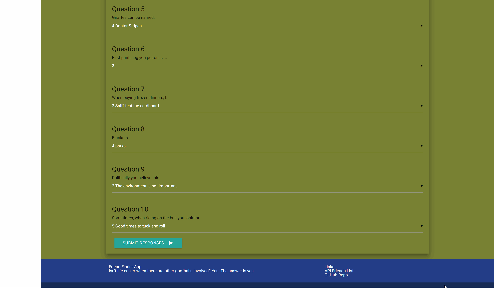

# FriendFinder Full Stack Application
Everyone loves a good click-hole quiz! Enjoy!

## History
A class project for Northwestern Coding Bootcamp. 

## Credits
Author: Caitlin Everett
Teachers: NWBC Folks!

## Technology
This node-based web application uses express, body-parser, path, handlebars, and heroku. The .gitignore file will keep these modules from downloading with the repo - so you must run npm install before starting the express server.  

## Sneak Peek

